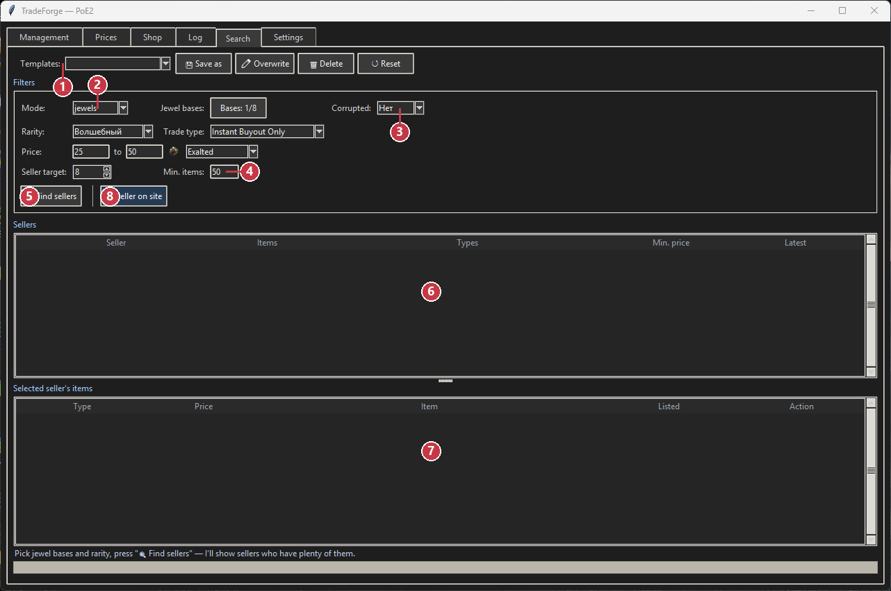
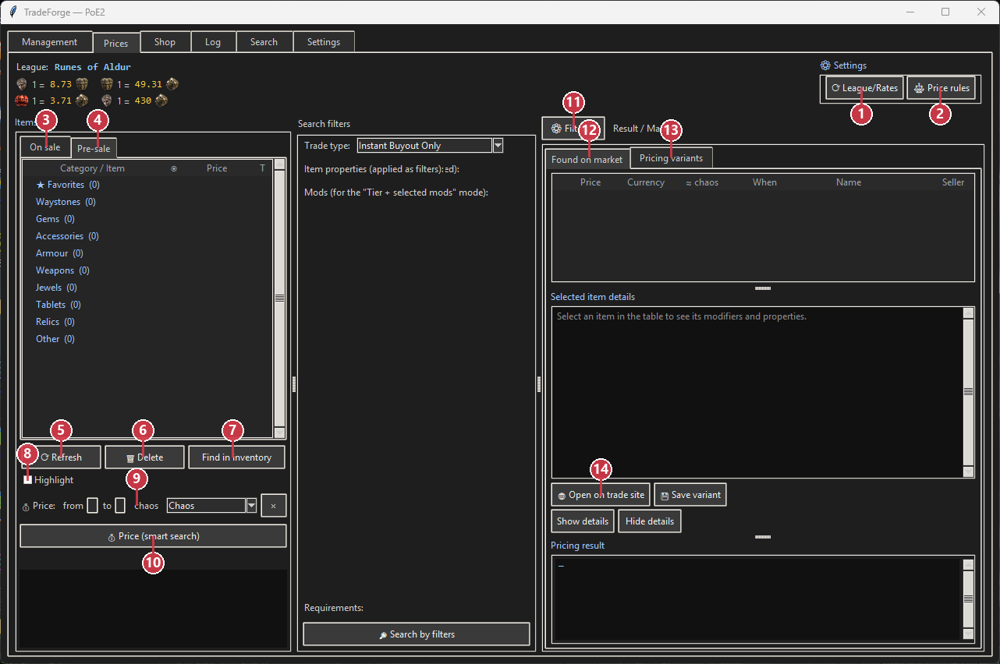
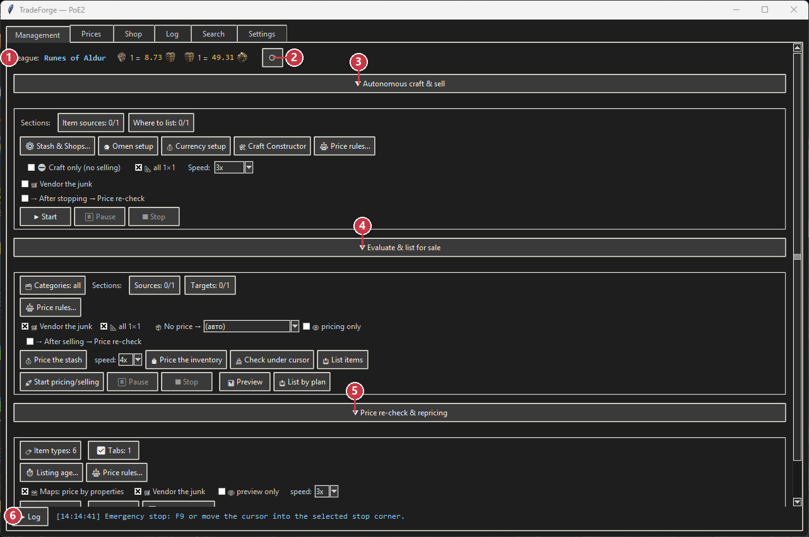
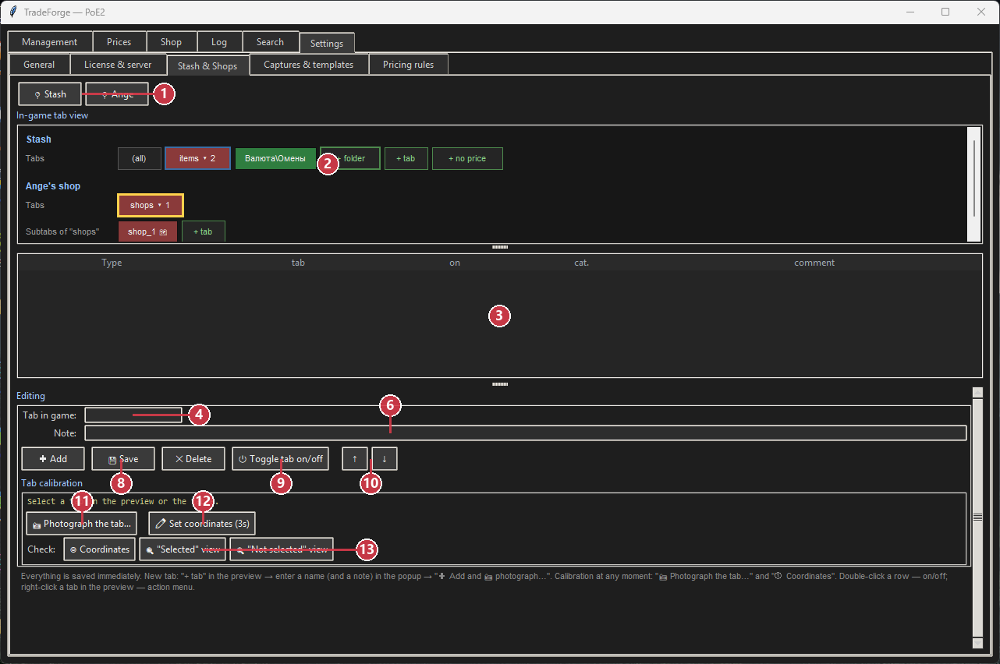

# TradeForge for Path of Exile 2

### A configurable helper for crafting, trading and shop management

**CRAFT · FIND · PRICE · LIST · REPRICE**

Path of Exile 2 · PoE2 · trade helper · crafting assistant · market pricing · seller search · shop listing

[English](README.md) · [Русский](README_RU.md) · [Quick start](docs/QUICK_START_EN.md) · [Releases](https://github.com/Svetl286/TradeForge-PoE2/releases) · [Telegram support](https://t.me/TradeForgePoE2Bot) · [Discord](https://discord.gg/UtU9Ty2bBv)

TradeForge brings the repetitive parts of a trading workflow into one clear interface. You define the rules, review the result and decide when to proceed; the program carries out the configured routine in the game window.

This repository is a public product showcase, documentation hub and binary-release channel. The private application source code is not published here, and this is not an open-source distribution.

> **Independent third-party software.** TradeForge is not affiliated with, endorsed by or supported by Grinding Gear Games. Automation can conflict with the game's Terms of Use and creates account risk, including possible restrictions. Read the [risk notice](#important-risk-notice) before use.

## Why TradeForge

| Everyday problem | TradeForge approach |
|---|---|
| Repeating the same craft sequence | Save a reusable Craft Constructor plan |
| Searching many separate offers | Group matching offers by seller |
| Buying a large quantity | Find sellers with the largest available stock |
| Comparing an item's market value | Run an automatic, comparison-based estimate |
| Preparing many listings | Apply category, price and shop rules in batches |
| Old listings becoming uncompetitive | Recheck and reprice them by your rules |

## Configurable crafting

Build a repeatable plan in **Craft Constructor**:

- choose the stage order and enable or disable individual stages;
- select the currency for each stage and the number of applications;
- assign omens to specific stages;
- save separate templates for different strategies.

The saved plan is executed through the configured stash tabs, which is useful when the same process has to be repeated across a batch of items.

More UI examples: [English feature gallery](docs/FEATURES.md).

## Seller search by item quantity

For a bulk purchase, the important question is often not the cheapest single listing, but **which sellers have the most matching items available**.

Set the item filters, currency, price range and the number of sellers to show. TradeForge groups matching offers, counts the available items for each seller and highlights sellers with the largest stock. An optional minimum-item threshold can filter out smaller inventories.

The **Open seller on website** action opens the selected seller's offers on the trade site. You complete the purchase yourself; TradeForge does not buy items on your behalf.

## Automatic market estimate

TradeForge reads supported items from a selected stash tab or inventory and searches for comparable market offers. The query starts with closer matches and can broaden when there is not enough data, giving you a useful reference before a sale.

Use **Price only / Pre-sale** mode to inspect the result first. In that mode the item is not moved or listed until you approve the next step. Market estimates are indicative and depend on the available comparisons.

## Listing and shop routing

After reviewing the estimate, TradeForge can:

- read items from configured sources;
- apply category and price-range rules;
- route items to the appropriate configured shop tab;
- prepare and place listings;
- keep the result in the program's tables and logs.

The practical workflow is **evaluate → review → list**. You keep the approval point while repetitive transfers and listing steps follow the rules you configured.

## Rechecking and repricing

Markets change. For existing listings you can configure listing-age rules, a repricing plan, a preview of proposed changes, category-specific conditions and separate rules per shop. This keeps a large inventory manageable without checking every old listing by hand.

## One connected workflow

`CRAFT → PRICE → REVIEW → LIST → REPRICE`

The stages can be used independently or connected into a longer scenario: check resources, run a saved craft plan, estimate the result, review the pre-sale table, route items to shops, list them and later recheck their prices.

<b>More features</b>

- reusable configuration templates;
- price ranges and category filters;
- preflight checks before a run;
- pause, resume, normal stop and emergency stop;
- progress indicators, tables and logs;
- Russian and English interface and manuals.

## License information

For current license options and availability, contact us through [Discord](https://discord.gg/UtU9Ty2bBv) or [Telegram](https://t.me/TradeForgePoE2Bot).

## Download

### Current release: `1.0.0`

- Installer: `TradeForge_Setup_1.0.0.exe`
- Published: `2026-08-02`
- Size: `70,057,824 bytes`
- SHA-256: `F53A52759B13DAAFCB2636EE22C1E5D09730E5D9C8CDE08D0B3208B06AC4C327`
- [Official VPS download](https://tradeforge.freelancepulse.work/api/v1/update/download?version=1.0.0)
- [GitHub Releases mirror](https://github.com/Svetl286/TradeForge-PoE2/releases/latest)

The built-in updater tries the VPS first. If that route repeatedly fails, it uses the latest verified GitHub Release asset as an automatic fallback; manual GitHub download remains available as a final option.

## Requirements

- Windows 10/11, 64-bit;
- Path of Exile 2;
- game client area exactly `1024×768`;
- Russian or English game client;
- internet access and a valid TradeForge license key;
- one-time setup and calibration before the first live run.

During live operations the program uses mouse and keyboard input and configured screen regions. Keep the game window available and do not use the computer for conflicting input at the same time.

## Safety and transparency

- Every release publishes its version, installer size and SHA-256.
- This public repository contains documentation, sanitized screenshots and release assets only; it does not contain the private source tree, account sessions, wallets, proxy lists, operator databases or private keys.
- The installer is currently not digitally code-signed, so Windows SmartScreen may display a warning. Verify the hash and download only from the official links above.
- Full support logs are submitted only through an explicit in-app action. Never post license keys, cookies, POESESSID, payment data or full logs in Issues.

Read [Security](SECURITY.md), [Privacy](PRIVACY.md) and [Verify a download](docs/VERIFY_DOWNLOAD.md) before installation.

## Important risk notice

TradeForge is an independent third-party automation tool. It is not affiliated with, endorsed by or supported by Grinding Gear Games. Automation may conflict with the game's Terms of Use and can expose an account to restrictions or a ban. TradeForge does not promise profit, undetectability, uninterrupted operation or freedom from account action. Use it only after understanding and accepting this risk.

## Support and community

- Discord: [community and support](https://discord.gg/UtU9Ty2bBv)
- Telegram: [licenses, payment and support](https://t.me/TradeForgePoE2Bot)
- Bugs and feature requests: [GitHub Issues](https://github.com/Svetl286/TradeForge-PoE2/issues)

Do not post license keys, payment data, tokens, POESESSID or full logs in a public Issue.

## Documentation

- [Quick start](docs/QUICK_START_EN.md)
- [Feature gallery](docs/FEATURES.md)
- [Known issues](KNOWN_ISSUES.md)
- [Security](SECURITY.md)
- [Privacy](PRIVACY.md)
- [Third-party notices](THIRD_PARTY_NOTICES.md)
- [Changelog](CHANGELOG.md)

<b>Search keywords</b>

Path of Exile 2 tool, PoE2 trading, PoE2 crafting, market pricing, item valuation, seller quantity search, bulk purchase helper, shop listing, listing management, repricing, stash workflow, trade assistant.

## Third-party acknowledgements

TradeForge uses language and stat data derived from [Exiled Exchange 2](https://github.com/Kvan7/Exiled-Exchange-2) under the MIT License. This does not imply endorsement or partnership. See [THIRD_PARTY_NOTICES.md](THIRD_PARTY_NOTICES.md).
