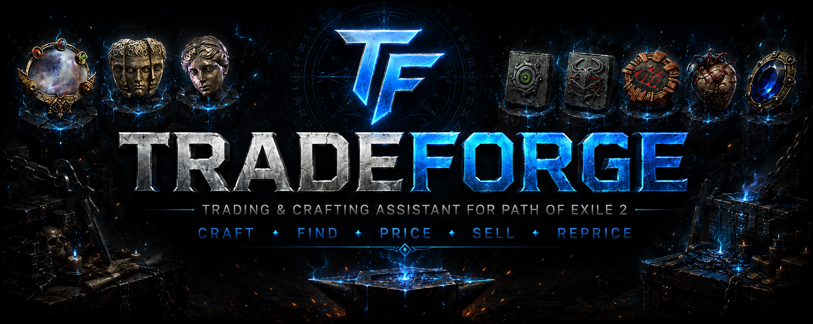
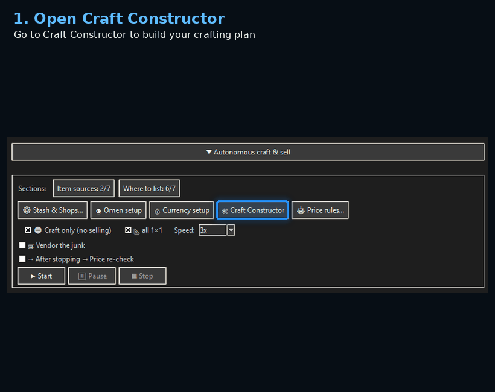
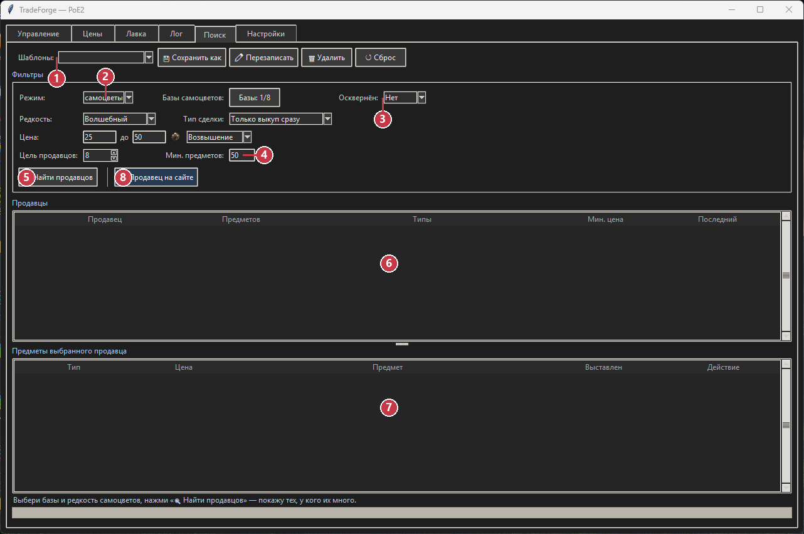
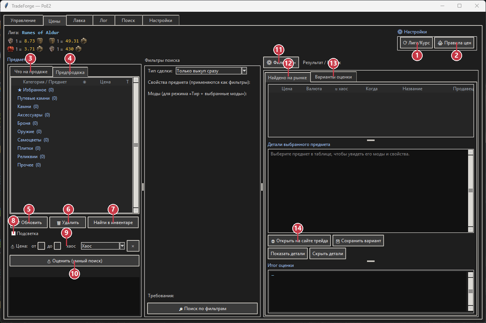
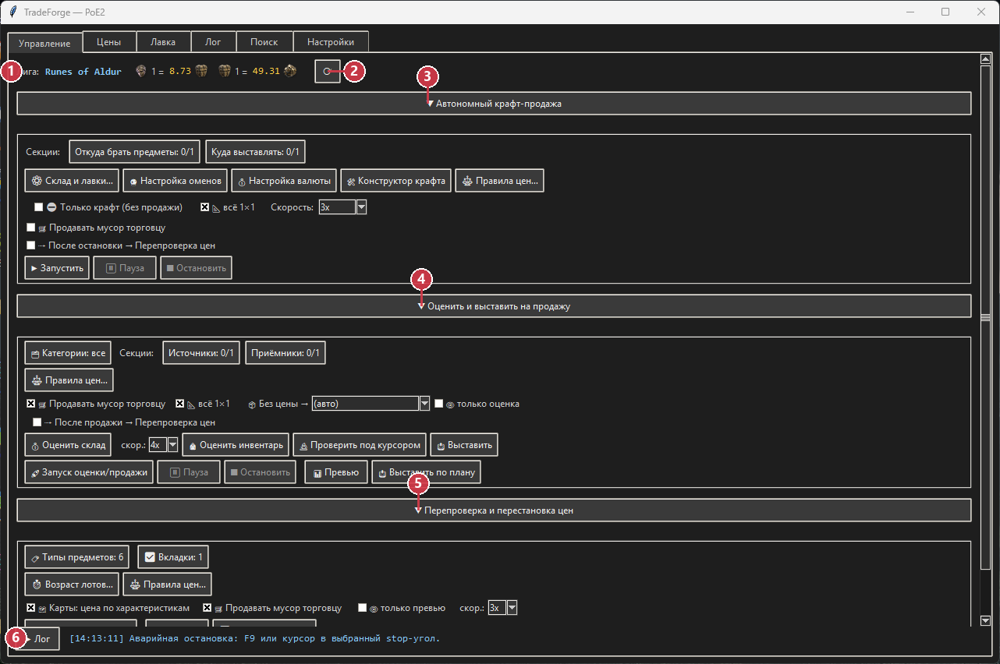

# TradeForge для Path of Exile 2

### Настраиваемый помощник для крафта, торговли и управления лавками

**КРАФТ · ПОИСК · ОЦЕНКА · ВЫСТАВЛЕНИЕ · ПЕРЕОЦЕНКА**

Path of Exile 2 · PoE2 · торговый помощник · крафт · оценка рынка · поиск продавцов · лавки · цены

[English](README.md) · [Русский](README_RU.md) · [Быстрый старт](docs/QUICK_START_RU.md) · [Релизы](https://github.com/Svetl286/TradeForge-PoE2/releases) · [Telegram для поддержки](https://t.me/TradeForgePoE2Bot) · [Discord](https://discord.gg/UtU9Ty2bBv)

TradeForge объединяет повторяющиеся операции вокруг торговли и крафта в одном понятном интерфейсе. Вы задаёте правила, проверяете результат и решаете, когда продолжать; программа выполняет настроенную рутину в игровом окне.

> **Независимое стороннее ПО.** TradeForge не связан с Grinding Gear Games, не одобрен и не поддерживается этой компанией. Автоматизация может противоречить правилам игры и привести к ограничениям для аккаунта. Перед использованием прочитайте [предупреждение о рисках](#важное-предупреждение-о-риске).

## Зачем нужен TradeForge

| Ручная проблема | Что делает TradeForge |
|---|---|
| Повторять один и тот же крафт | Сохраняет план в «Конструкторе крафта» |
| Просматривать множество отдельных объявлений | Группирует найденные предложения по продавцам |
| Закупать большой объём | Ищет продавцов по минимальному количеству предметов |
| Сравнивать предмет с рынком | Выполняет автоматическую оценку по похожим предложениям |
| Подготавливать много лотов | Применяет правила категорий, цен и лавок |
| Следить за старыми лотами | Перепроверяет и меняет цены по заданным правилам |

## Настраиваемый крафт

В **Конструкторе крафта** можно собрать повторяемый сценарий:

- задать порядок стадий и включать или отключать отдельные этапы;
- выбрать сферу для каждой стадии и количество применений;
- назначить омены конкретным этапам;
- сохранить отдельные шаблоны под разные стратегии.

Сохранённый план выполняется через настроенные вкладки склада. Это удобно, когда один и тот же процесс нужно повторить на серии предметов.

Другие примеры интерфейса: [галерея возможностей](docs/FEATURES.md).

## Поиск продавцов по количеству предметов

При массовой закупке важна не только цена одного лота, но и **наличие нужного количества у одного продавца**.

Укажите фильтры товара, валюту, диапазон цены, минимальное количество у продавца и число продавцов. TradeForge сгруппирует подходящие предложения, чтобы было проще выбрать один или несколько магазинов с нужным ассортиментом, не открывая десятки объявлений по одному.

Кнопка **«Открыть продавца на сайте»** открывает предложения выбранного продавца на торговой площадке. Покупку вы подтверждаете сами; TradeForge не совершает её вместо пользователя.

## Автоматическая оценка рынка

TradeForge читает поддерживаемые предметы из выбранной вкладки склада или инвентаря и ищет сопоставимые предложения. Сначала используются более точные совпадения; при нехватке данных запрос может постепенно расширяться.

В режиме **«Только оценка / Предпродажа»** можно сначала проверить рассчитанную цену. Предмет не перемещается и не выставляется, пока вы не разрешите следующий этап. Оценка является ориентировочной и зависит от найденных сравнений.

## Выставление и распределение по лавкам

После проверки цены TradeForge может:

- взять предметы из настроенных источников;
- применить правила категорий и ценовых диапазонов;
- распределить предметы по нужным вкладкам лавок;
- подготовить и выставить лоты;
- сохранить результат в таблицах и журналах программы.

Рабочая схема: **оценить → проверить → выставить**. Контроль результата остаётся у пользователя, а повторяющиеся действия выполняются по его настройкам.

## Перепроверка и перестановка цен

Рынок меняется. Для уже выставленных лотов можно задать правила возраста, переоценки, предпросмотр изменений, отдельные условия для категорий и разные правила для лавок. Так ассортимент остаётся актуальным без ручной проверки каждого старого лота.

## Единый сценарий

`КРАФТ → ОЦЕНКА → ПРОВЕРКА → ВЫСТАВЛЕНИЕ → ПЕРЕОЦЕНКА`

Этапы можно запускать отдельно или связать в последовательность: проверить ресурсы, выполнить сохранённый крафт, оценить результат, проверить предпродажу, разложить предметы по лавкам, выставить лоты и позже перепроверить их цены.

<b>Дополнительные возможности</b>

- повторное использование шаблонов настроек;
- фильтры категорий и диапазонов цен;
- предстартовые проверки;
- пауза, продолжение, штатная и аварийная остановка;
- прогресс, таблицы и журналы;
- русский и английский интерфейс и руководства.

## Тарифы лицензии

Цены каталога приведены для ориентира; актуальные условия подтвердите перед оплатой:

| Срок | Стандарт | Launch-предложение* |
|---|---:|---:|
| 3 дня | 3 USDT | 1,5 USDT |
| 10 дней | 12 USDT | 6 USDT |
| 30 дней | 25 USDT | 12,5 USDT |

\* Срок действия Launch-цен и итоговые условия могут меняться. За текущим предложением и выдачей лицензии обращайтесь в [Telegram поддержки](https://t.me/TradeForgePoE2Bot).

## Скачать TradeForge

### Текущий релиз: `1.0.0`

- Установщик: `TradeForge_Setup_1.0.0.exe`
- Дата публикации: `2026-08-02`
- Размер: `70 057 824 байт`
- SHA-256: `F53A52759B13DAAFCB2636EE22C1E5D09730E5D9C8CDE08D0B3208B06AC4C327`
- [Официальная загрузка с VPS](https://tradeforge.freelancepulse.work/api/v1/update/download?version=1.0.0)
- [Зеркало GitHub Releases](https://github.com/Svetl286/TradeForge-PoE2/releases/latest)

Встроенное обновление сначала использует VPS. Если маршрут несколько раз недоступен, программа автоматически использует проверенный asset последнего GitHub Release; ручная загрузка с GitHub остаётся запасным вариантом.

## Требования

- Windows 10/11, 64-bit;
- Path of Exile 2;
- область игрового клиента ровно `1024×768`;
- русский или английский язык клиента;
- интернет и действующий ключ лицензии TradeForge;
- первичная настройка и калибровка перед первым рабочим запуском.

Во время живых операций программа использует мышь, клавиатуру и настроенные области экрана. Окно игры должно оставаться доступным, а параллельный ввод с компьютера лучше не использовать.

## Безопасность и прозрачность

- Для каждого релиза публикуются версия, размер установщика и SHA-256.
- В публичном репозитории находятся только документация, очищенные скриншоты и release-материалы; здесь нет закрытого исходного кода, игровых сессий, кошельков, прокси, операторских баз или приватных ключей.
- Установщик пока не подписан цифровой подписью, поэтому Windows SmartScreen может показать предупреждение. Сверяйте хеш и скачивайте файл только по официальным ссылкам.
- Полные логи отправляются только после явного действия пользователя в программе. Не публикуйте в Issues ключи, cookies, POESESSID, платёжные данные или полные логи.

Перед установкой прочитайте [Security](SECURITY.md), [Privacy](PRIVACY.md) и [инструкцию проверки скачанного файла](docs/VERIFY_DOWNLOAD.md).

## Важное предупреждение о риске

TradeForge — независимый сторонний инструмент автоматизации. Он не связан с Grinding Gear Games, не одобрен и не поддерживается этой компанией. Автоматизация может противоречить правилам игры и привести к ограничениям или блокировке аккаунта. TradeForge не гарантирует прибыль, незаметность, непрерывную работу или отсутствие санкций. Используйте его только после понимания и принятия этого риска.

## Поддержка и сообщество

- Discord: [сообщество и поддержка](https://discord.gg/UtU9Ty2bBv)
- Telegram: [лицензии, оплата и поддержка](https://t.me/TradeForgePoE2Bot)
- Ошибки и предложения: [GitHub Issues](https://github.com/Svetl286/TradeForge-PoE2/issues)

Не публикуйте в открытом Issue ключи, платёжные данные, токены, POESESSID или полные логи.

## Документация

- [Быстрый старт](docs/QUICK_START_RU.md)
- [Галерея возможностей](docs/FEATURES.md)
- [Известные проблемы](KNOWN_ISSUES.md)
- [Security](SECURITY.md)
- [Privacy](PRIVACY.md)
- [Сторонние материалы](THIRD_PARTY_NOTICES.md)
- [История изменений](CHANGELOG.md)

<b>Поисковые ключи</b>

Path of Exile 2 программа, PoE2 торговля, PoE2 крафт, оценка предметов, поиск продавцов по количеству, массовая закупка, выставление лотов, управление лавкой, переоценка, вкладки склада, помощник торговли.

## Сторонние материалы

TradeForge использует языковые данные и данные характеристик, производные от [Exiled Exchange 2](https://github.com/Kvan7/Exiled-Exchange-2), на условиях лицензии MIT. Это не означает одобрения или партнёрства. Подробности: [THIRD_PARTY_NOTICES.md](THIRD_PARTY_NOTICES.md).
