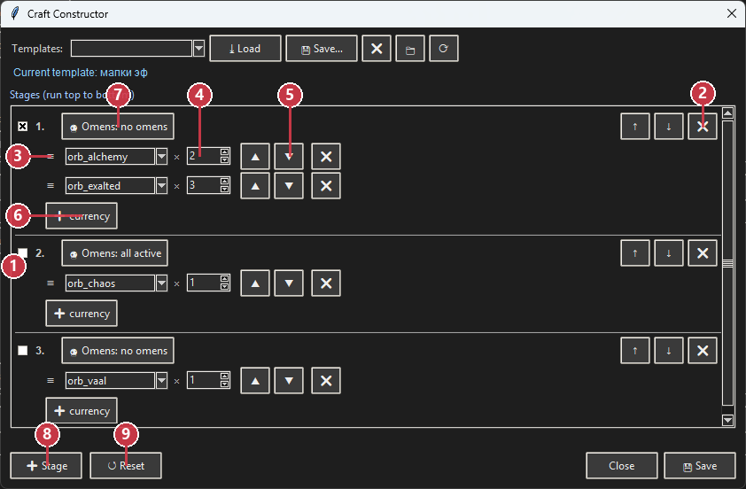

# TradeForge feature gallery

These screenshots were generated from a sanitized public profile without
operator tabs, listings, account sessions or secrets.

## Management / Управление

## Pricing / Цены

## Seller search / Поиск продавцов

## Craft constructor / Конструктор крафта

## Storage and shop setup / Склад и лавки

